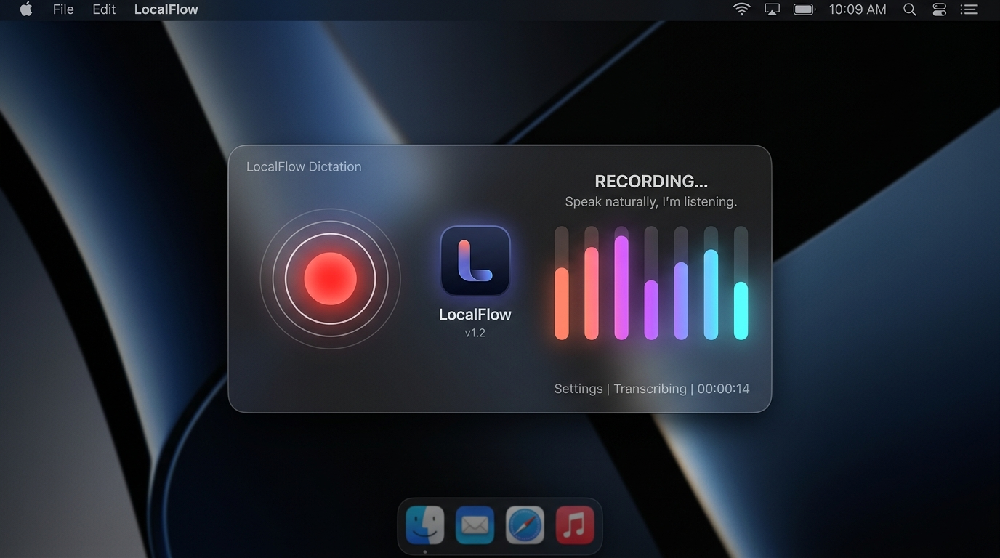
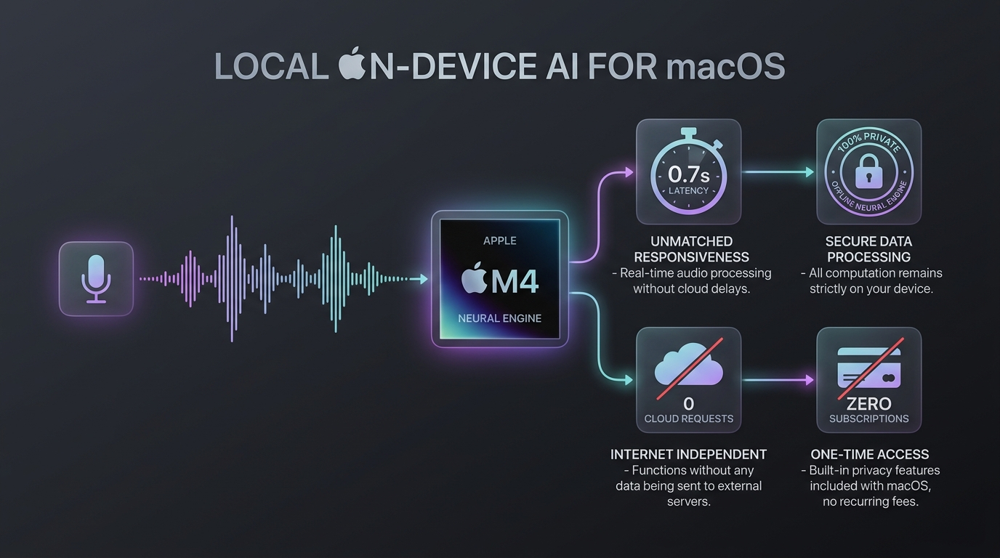

<p align="center">
  
</p>

<h1 align="center">LocalFlow</h1>

<p align="center">
  <strong>100% Offline, Native macOS AI Dictation — Powered by Apple Neural Engine & WhisperKit</strong><br>
  <em>Speak naturally in any Mac app. Real-time local transcription. Zero cloud lag. Zero subscriptions. Zero data leaks.</em>
</p>

<p align="center">
  <a href="https://github.com/therealone00/LocalFlow/releases/latest"></a>
  
  
  
  <a href="https://github.com/sponsors/therealone00"></a>
  
</p>

<p align="center">
  <a href="#-download--installation"><strong>Download DMG</strong></a> •
  <a href="#-features"><strong>Features</strong></a> •
  <a href="#-architecture"><strong>Architecture</strong></a> •
  <a href="#-comparison"><strong>Comparison</strong></a> •
  <a href="#-github-sponsors--support"><strong>Sponsor</strong></a> •
  <a href="https://therealone00.github.io/LocalFlow/"><strong>Website</strong></a>
</p>

---

## ⚡ What is LocalFlow?

Inspired by the fluidity of Wispr Flow, **LocalFlow** brings frictionless voice dictation into macOS with one fundamental principle:

> **EVERY SINGLE BYTE OF SPEECH STAYS ON YOUR MAC.**
> No cloud transcription. No OpenAI or Google APIs. No audio uploads. No accounts. No monthly subscriptions.

Whether you're writing code in **VS Code**, replying in **Slack**, drafting an email in **Mail / Safari**, or taking notes in **Obsidian / Notes**, hold your hotkey, speak your mind, and LocalFlow types your words directly into the cursor position in **under 0.8 seconds**.

---

## 🚀 Download & Installation

### Option 1: Direct DMG Download (Recommended)

1. Download the latest **[LocalFlow-v1.0.0.dmg](https://github.com/therealone00/LocalFlow/releases/latest/download/LocalFlow-v1.0.0.dmg)**.
2. Open the disk image and drag **LocalFlow.app** into your **Applications** folder.
3. Launch LocalFlow from Applications or Spotlight (`Cmd + Space`).
4. Follow the 1-click permission prompt:
   - **Mikrofon**: Local on-device audio recording.
   - **Bedienungshilfen (Accessibility)**: Required to inject text directly into your active cursor in any app.

### Option 2: Build from Source

```bash
git clone https://github.com/therealone00/LocalFlow.git
cd LocalFlow
./scripts/build_app.sh
open build/LocalFlow.app
```

---

## ✨ Features

- 🎙️ **Universal Direct Text Injection**: Writes directly into Safari, Chrome, Slack, TextEdit, VS Code, Notes, Cursor, etc.
- ⚡ **Apple Neural Engine Acceleration**: WhisperKit runs whisper-base / whisper-tiny in ~0.7s at 16x real-time speed.
- 🎨 **Obsidian-Glass Floating Bar**: Ultra-thin frosted glass with pulsing recording ring, active target app badge, and fluid 7-bar vertical neon gradient equalizer.
- ⌨️ **Push-to-Talk & Hands-Free Toggle**:
  - Hold `Fn` (Globe) or `Right Option` to speak, release to insert.
  - Quick-tap enters hands-free mode; press `Enter` or the hotkey again to finish.
  - Also supports `Control + Option` and custom keybindings.
- 🧠 **On-Device Text Intelligence**:
  - Removes German & English filler words (*„äh“, „ähm“, „quasi“, „sozusagen“, „like“, „you know“*).
  - Automatically resolves spoken self-corrections (*„morgen um 3, nein um 4 Uhr“ ➔ „morgen um 4 Uhr“*).
  - Smart automatic punctuation and capitalization.
- 🛡️ **Zero-Trust Privacy**: Audio buffer is kept in RAM and discarded immediately after transcription. No logs, no telemetry, no network calls.

---

## 🔬 Architecture & Privacy

<p align="center">
  
</p>

```
[ Microphone Input ] 
       │ 16kHz Float32 Buffer (os_unfair_lock, Zero Jitter)
       ▼
[ Voice Activity Detector (VAD) ]
       │ Energy-adaptive silence cut
       ▼
[ WhisperKit Engine ] ──► Apple Neural Engine (ANE) / CoreML
       │ ~0.7s local inference
       ▼
[ Text Intelligence Pipeline ]
       │ 1. Filler Word Removal
       │ 2. Spoken Self-Correction Parser
       │ 3. Contextual Punctuation Engine
       ▼
[ Accessibility & Direct Injection ] ──► Focused macOS Cursor
```

---

## 📊 Comparison: Why LocalFlow?

| Feature | LocalFlow | Wispr Flow | Superwhisper | macOS Dictation |
| :--- | :---: | :---: | :---: | :---: |
| **Cloud Dependency** | ❌ **0% Offline** | ☁️ Required | Optional | ☁️ Hybrid |
| **Monthly Subscription** | 💸 **$0 Free / Open** | $12–$15 / mo | $8 / mo | Free |
| **Apple Neural Engine** | ⚡ **Native CoreML** | ❌ Cloud GPU | ✅ Local | ❌ Generic |
| **Privacy & GDPR** | 🛡️ **100% Safe** | ⚠️ Transmitted | ⚠️ Tier-dependent | ⚠️ Apple Server |
| **Direct Text Insertion**| ✅ Universal | ✅ Universal | ✅ Universal | ⚠️ Basic |
| **Smart Self-Correction**| ✅ Intelligent | ✅ Cloud AI | ⚠️ Pro only | ❌ None |

---

## 💖 GitHub Sponsors & Support

LocalFlow is 100% free, open-source, and privacy-respecting software built with passion.

If LocalFlow saves you time and elevates your Mac workflow, please consider backing development on **[GitHub Sponsors](https://github.com/sponsors/therealone00)**:

<p align="center">
  <a href="https://github.com/sponsors/therealone00">
    
  </a>
</p>

Your sponsorship funds:
- New model fine-tuning & multilingual optimizations.
- Future local LLM integration (e.g. Llama 3 / Mistral via MLX on Apple Silicon).
- Continued maintenance, updates for future macOS versions, and zero telemetry.

---

## 📄 License

MIT License © 2026 LocalFlow Contributors & [therealone00](https://github.com/therealone00).
