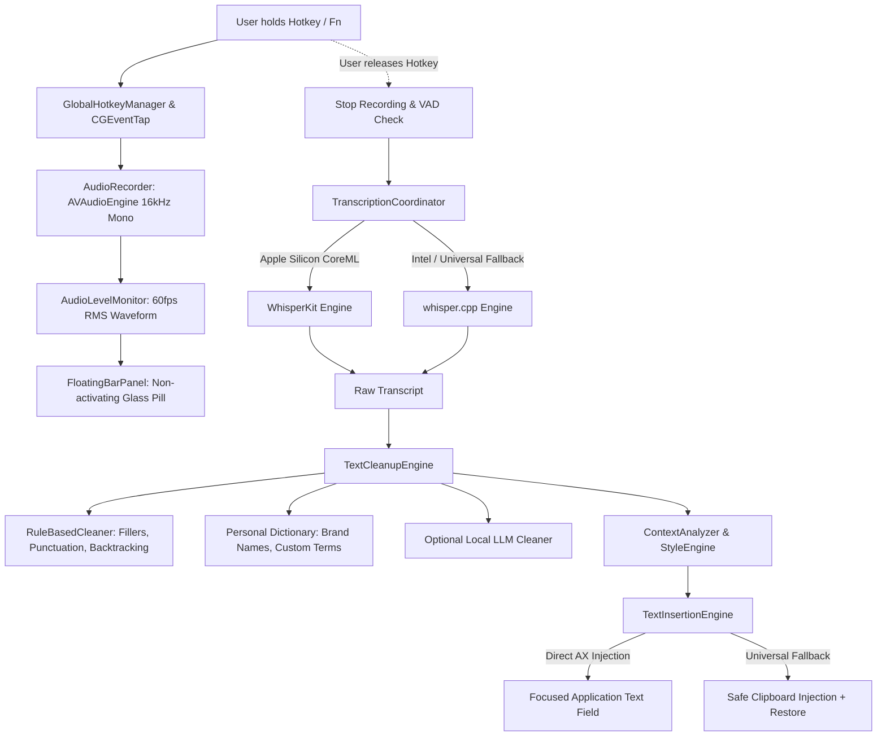

# LocalFlow 🎙️⚡

> **Native, ultra-fast, 100% local AI dictation for macOS.**  
> *Inspired by Wispr Flow, engineered with zero cloud dependencies.*

[](https://apple.com)
[](https://apple.com)
[](file:///Users/maximilianleinz/dicere/ARCHITECTURE.md)
[](LICENSE)

---

## Highlights

- 🔒 **100% Local & Private**: Speech recognition and text intelligence run entirely on your Mac's Neural Engine, GPU, and CPU. No cloud APIs, no OpenAI/Anthropic keys, no network audio streaming, no telemetry.
- ⚡ **Push-to-Talk Experience**: Hold `Fn` (or dedicated MacBook Dictation / Mic key), speak, release. Your transcribed and polished text is immediately typed at the cursor position.
- 🪟 **Zero Focus Theft**: The glass-morphic floating bar never steals keyboard focus or deactivates your active application (Safari, Chrome, VS Code, Slack, Notes, Xcode, etc.).
- 🧠 **Multi-Stage Text Intelligence**:
  - **Rule-Based Cleaner**: Eliminates filler words (`äh`, `ähm`, `uh`, `um`), spoken punctuation commands (`"Punkt"`, `"Komma"`, `"neue Zeile"`), and spoken list formatting (`"erstens ... zweitens ..."`).
  - **Self-Correction & Backtrack Resolver**: Seamlessly repairs mid-sentence speech changes (*"Treffen wir uns morgen, nee Donnerstag um drei"* ➔ *"Treffen wir uns Donnerstag um drei."*).
  - **Local LLM Polish (Optional)**: Optional local GGUF model via llama.cpp for nuanced speech repair with a strictly constrained, non-generative prompt.
- 🍏 **Apple Silicon & Intel Universal Support**:
  - **WhisperKit**: Native CoreML acceleration on Apple Silicon (M1/M2/M3/M4) supporting `openai_whisper-tiny`, `base`, and `small`.
  - **whisper.cpp**: Robust fallback engine for Intel Macs (x86_64) or universal CPU/Metal execution.
- 🎯 **Universal Text Insertion**: Direct macOS Accessibility API injection (`kAXSelectedTextAttribute`) with a resilient, clipboard-safe fallback that preserves your previous clipboard items.

---

## System Architecture Overview



---

## Getting Started

### Prerequisites

- macOS 14.0 (Sonoma) or newer
- Apple Silicon (M-Series) or Intel Mac
- Xcode 15+ / Command Line Tools (`swift-driver` 6.0+)

### Building and Running

1. Clone or navigate to the repository:
   ```bash
   cd /Users/maximilianleinz/dicere
   ```

2. Run automated tests:
   ```bash
   swift test
   ```

3. Build the native `.app` bundle:
   ```bash
   ./scripts/build_app.sh
   ```
   The compiled, signed application bundle will be placed at:
   `build/LocalFlow.app`

4. Launch the application:
   ```bash
   open build/LocalFlow.app
   ```

---

## Required Permissions

When you launch LocalFlow for the first time, the onboarding guide will assist you with two essential macOS permissions:

1. **Microphone**: Needed to capture your voice locally via `AVAudioEngine`.
2. **Accessibility**:
   - Needed for `CGEventTap` to monitor global push-to-talk hotkeys when the app is in the background.
   - Needed for `AXUIElement` to inspect the focused element and insert text directly at your cursor.

> [!TIP]
> If you wish to use the dedicated **MacBook Dictation / Microphone key (F5)** with LocalFlow, ensure macOS System Dictation is disabled or set to a different shortcut in:  
> `System Settings ➔ Keyboard ➔ Dictation ➔ Shortcut`.

---

## Keyboard Shortcuts

| Shortcut | Action | Description |
| :--- | :--- | :--- |
| **Hold `Fn` / Globe** | Push-to-Talk | Records while held, transcribes & inserts on release |
| **Double-tap `Fn`** | Toggle Hands-Free | Starts recording without holding; press again or stop on silence |
| **Escape (`Esc`)** | Cancel | Aborts active dictation and discards audio |
| **Cmd + Ctrl + V** | Paste Last Dictation | Re-inserts your last transcribed text |

---

## Text Intelligence Examples

| Spoken Input | Cleaned Output |
| :--- | :--- |
| *"ähm kannst du Peter sagen dass wir uns morgen treffen"* | *"Kannst du Peter sagen, dass wir uns morgen treffen?"* |
| *"wir treffen uns morgen nee Donnerstag um drei"* | *"Wir treffen uns Donnerstag um drei."* |
| *"Kannst du mir ähm warte nein kannst du mir bitte erklären wie ein neuronales Netzwerk funktioniert"* | *"Kannst du mir bitte erklären, wie ein neuronales Netzwerk funktioniert?"* |
| *"Hallo Peter Komma wie geht es dir Fragezeichen neue Zeile Alles super Punkt"* | *"Hallo Peter,\nwie geht es dir?\nAlles super."* |
| *"Meine Aufgaben sind erstens Rechnung schicken zweitens Peter anrufen drittens Präsentation fertig machen"* | *"Meine Aufgaben sind\n1. Rechnung schicken\n2. Peter anrufen\n3. Präsentation fertig machen"* |

---

## Configuration & Settings

LocalFlow provides a full native macOS settings interface accessible from the menu bar:
- **General**: Launch at Login (`SMAppService`), Menu Bar icon, Ping sounds.
- **Dictation**: Trigger mode, microphone selection, spoken language, auto-stop silence threshold.
- **Intelligence**: Cleanup mode (`Fast`, `Balanced`, `Smart`), feature toggles, app context styling.
- **Models**: Whisper model tiers (`Tiny`, `Base`, `Small`) with disk management; LLM status.
- **Dictionary**: Custom user vocabulary and phonetic replacements (`"Swift UI"` ➔ `"SwiftUI"`).
- **Appearance**: System / Light / Dark theme, compact/standard floating bar, live transcript toggle.
- **Privacy**: Zero-cloud badge, history retention, audio discard enforcement.
- **Advanced**: Engine selector (`Auto`, `WhisperKit`, `whisper.cpp`), model prewarm policy.
